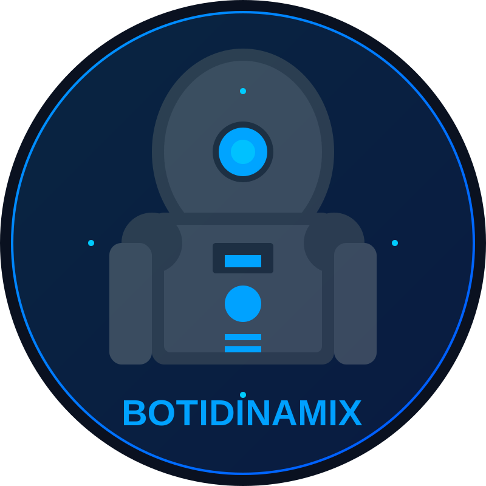

# CODESTORM

<div align="center">
  
  <h3>Plataforma de Desarrollo Autónomo Impulsada por IA</h3>
  <p><i>Desarrollado por BOTIDINAMIX AI</i></p>

  <!-- Video de demostración -->
  <video width="80%" controls>
    <source src="public/codestorm.mp4" type="video/mp4">
    Tu navegador no soporta el elemento de video.
  </video>
  <p><i>Video de demostración de CODESTORM en acción</i></p>
</div>

## 🌩️ ¿Qué es CODESTORM?

CODESTORM es una plataforma avanzada de desarrollo autónomo que revoluciona la forma en que se crean aplicaciones y soluciones de software. Utilizando un sistema de agentes especializados impulsados por IA, CODESTORM automatiza y optimiza todo el proceso de desarrollo, desde la planificación inicial hasta la generación y organización del código.

La plataforma está diseñada para:
- **Acelerar el desarrollo** de proyectos complejos mediante la automatización inteligente
- **Mejorar la calidad del código** a través de análisis y optimizaciones continuas
- **Facilitar la colaboración** entre humanos e IA en el proceso de desarrollo
- **Proporcionar una experiencia interactiva** con retroalimentación en tiempo real

## ✨ Características Principales

### 🤖 Sistema de Agentes Especializados

CODESTORM implementa una arquitectura modular con agentes especializados que trabajan en conjunto:

| Agente | Función |
|--------|---------|
| **Agente de Planificación** | Analiza los requisitos y crea planes detallados de desarrollo |
| **Agente de Generación de Código** | Produce código de alta calidad basado en los planes establecidos |
| **Agente de Sincronización de Archivos** | Mantiene sincronizados los archivos entre el terminal y el explorador |
| **Agente de Modificación de Código** | Realiza cambios inteligentes en el código existente con actualización automática del preview |
| **Agente de Observación de Archivos** | Monitorea en tiempo real los archivos creados y su estructura |
| **Agente de Separación de Código** | Segmenta automáticamente código combinado en archivos individuales |
| **Agente de Corrección de Código** | Detecta y corrige errores de sintaxis, lógica, seguridad y rendimiento |
| **Agente de Seguimiento** | Documenta el proceso de desarrollo y mantiene un registro del progreso |
| **Agente Lector** | Analiza archivos existentes y proporciona contexto para modificaciones |
| **Agente de Diseño Arquitectónico** | Genera automáticamente archivos HTML/CSS para interfaces visuales |

### 🔍 Función "Enhance Prompt"

Una característica innovadora que mejora automáticamente las instrucciones del usuario antes de enviarlas al sistema:
- Clarifica requisitos ambiguos
- Añade detalles técnicos relevantes
- Optimiza la estructura de la solicitud
- Mejora la precisión de los resultados generados
- Proporciona retroalimentación visual durante el proceso de mejora

### 🏗️ Constructor con Sistema de Aprobación por Etapas

Un flujo de trabajo conversacional que otorga al usuario control total sobre el proceso de creación:
- Sistema de aprobación por etapas para validar cada fase del desarrollo
- Chat interactivo avanzado para comunicación fluida con los agentes
- Corrector de código inteligente que sugiere mejoras y soluciones
- Visualización en tiempo real del progreso del proyecto
- Métricas detalladas del avance por etapas y tipos de archivos

### 🔧 Corrector de Código Multi-Agente

Un sistema revolucionario de corrección de código con arquitectura multi-agente:

#### **🤖 Sistema de 3 Agentes Especializados:**
- **Agente Analizador**: Examina el código y detecta patrones problemáticos
- **Agente Detector de Errores**: Identifica errores de sintaxis, lógica, seguridad y rendimiento
- **Agente Generador de Código**: Produce código corregido y optimizado

#### **🎯 Características Avanzadas:**
- **Instrucciones en lenguaje natural**: Describe en español qué quieres corregir
- **Análisis en tiempo real**: Feedback instantáneo mientras escribes
- **Modal responsivo**: Interfaz adaptable a cualquier tamaño de pantalla
- **Editor dual**: Vista lado a lado del código original y corregido
- **Diff viewer**: Visualización clara de cambios con aplicación selectiva
- **Métricas detalladas**: Estadísticas de confianza, mejora y problemas detectados
- **Opciones configurables**: Análisis de seguridad, rendimiento, generación de tests
- **Exportación completa**: Código corregido y reportes detallados

#### **📱 Interfaz Completamente Responsiva:**
- **Paneles adaptativos**: Se ajustan automáticamente al tamaño de pantalla
- **Navegación móvil**: Botón hamburguesa para ocultar/mostrar paneles
- **Texto responsivo**: Tamaños e iconos que se adaptan al dispositivo
- **Overlay inteligente**: Cierre automático en dispositivos táctiles
- **Scroll optimizado**: Control perfecto de desbordamiento en todos los paneles

### ✂️ Separador de Código

Herramienta especializada que:
- Analiza bloques de código extensos
- Identifica componentes lógicos y funcionales
- Separa el código en archivos independientes con la estructura adecuada
- Mantiene la coherencia entre los archivos generados

### 👁️ Observador de Archivos

Sistema de monitoreo que:
- Analiza en tiempo real la estructura y contenido de los archivos
- Proporciona visualizaciones del árbol de archivos
- Mejora las sugerencias durante el desarrollo
- Comunica información relevante a otros agentes del sistema

### 🌐 Modal de Vista Previa Web Universal

Un sistema completo de previsualización web que funciona en todas las páginas de CODESTORM:

#### **🎯 Funcionalidades Principales:**
- **Botón flotante inteligente**: Aparece automáticamente cuando detecta archivos web
- **Renderizado real**: HTML + CSS + JavaScript completamente funcional
- **Detección automática**: Identifica proyectos web y combina archivos automáticamente
- **Controles responsivos**: Vista previa en desktop, tablet y móvil
- **Actualización en tiempo real**: Se actualiza automáticamente al modificar archivos

#### **🔧 Características Técnicas:**
- **Integración universal**: Disponible en Home, WebAI, Agent y todas las páginas
- **Sandbox seguro**: Ejecución controlada de JavaScript con permisos específicos
- **Blob URLs**: Renderizado eficiente y seguro sin archivos temporales
- **Gestión de memoria**: Limpieza automática de recursos para evitar memory leaks
- **Manejo de errores**: Mensajes informativos y opciones de recuperación

#### **📱 Controles Avanzados:**
- **Viewports responsivos**: Cambio instantáneo entre tamaños de pantalla
- **Refresh inteligente**: Regeneración completa del contenido
- **Nueva pestaña**: Apertura en navegador para testing completo
- **Pantalla completa**: Modo inmersivo para desarrollo
- **Indicadores visuales**: Tamaños de viewport y estado de carga

### 🎨 Interfaz Moderna y Responsiva

- Diseño adaptable para dispositivos móviles y de escritorio
- Animaciones sutiles inspiradas en el concepto de "tormenta de código"
- Paneles colapsables para optimizar el espacio de trabajo
- Botones flotantes mejorados con navegación al menú principal
- Logo de BOTIDINAMIX AI posicionado en la esquina superior izquierda
- Temas visuales personalizables con efectos futuristas
- **Modal responsivo universal**: Todos los modales se adaptan perfectamente a cualquier pantalla

### 🔄 Actualización Automática del Preview

Una característica revolucionaria que mejora la experiencia de desarrollo:

- **Detección inteligente** de archivos estáticos (HTML, CSS, JavaScript)
- **Actualización en tiempo real** del CodePreview/WebView cuando se modifican archivos
- **Sincronización automática** entre modificaciones y vista previa
- **Feedback visual inmediato** sin intervención manual del usuario
- **Comunicación eficiente** mediante eventos personalizados entre componentes

### 🧩 Segmentación Automática de Código

Sistema avanzado de separación de archivos integrado en toda la plataforma:

- **Detección automática** de código combinado que necesita segmentación
- **Análisis inteligente** por patrones de comentarios, bloques de código y declaraciones
- **Generación de archivos individuales** perfectamente organizados
- **Consistencia total** entre página principal y Constructor
- **Manejo robusto** de errores con fallbacks seguros

### 🏗️ Generación Automática de Interfaces Visuales

El DesignArchitectAgent ahora está integrado en toda la plataforma:

- **Generación automática** de archivos HTML/CSS para TODAS las aplicaciones
- **Detección inteligente** de colores y paletas profesionales por industria
- **Diseño responsivo** mobile-first con estructura HTML5 semántica
- **Variables CSS** organizadas y cumplimiento de accesibilidad WCAG 2.1 AA
- **Integración transparente** sin afectar la funcionalidad existente

### 🎤 Sistema de Reconocimiento de Voz Avanzado

CODESTORM incluye un sistema completo de reconocimiento de voz optimizado para español:

- **Reconocimiento nativo** usando la API Speech Recognition del navegador
- **Configuración optimizada** para español (es-ES) con alta precisión
- **Sistema de coordinación** que evita conflictos entre múltiples instancias
- **Auto-reparación inteligente** que diagnostica y corrige problemas automáticamente
- **Diagnóstico completo** con herramientas de depuración integradas
- **Compatibilidad universal** con Chrome, Edge, Safari y dispositivos móviles
- **Manejo robusto de errores** con recuperación automática

#### Características del Sistema de Voz:

- **VoiceCoordinator**: Gestiona acceso exclusivo y previene conflictos
- **UnifiedVoiceService**: Servicio centralizado con configuración optimizada
- **Auto-reparación**: Sistema que detecta y corrige problemas automáticamente
- **Diagnóstico visual**: Componente para identificar y resolver problemas
- **Filtros de post-procesamiento**: Mejoran la precisión de transcripción

### 🌐 Acceso Público y Configuración de Red

CODESTORM puede ser configurado para acceso público desde cualquier dispositivo:

- **Configuración automática** para exposición pública con IP específica
- **Scripts dedicados** para modo local y público
- **Configuración CORS** optimizada para acceso externo
- **Documentación completa** para configuración de firewall y router
- **Soporte para HTTPS** y conexiones seguras
- **Compatibilidad móvil** completa para acceso remoto

## 🛠️ Tecnologías Utilizadas

- **Frontend**: React, TypeScript, Tailwind CSS
- **Modelos de IA**: Claude (Anthropic), GPT (OpenAI), Gemini (Google)
- **Herramientas de Desarrollo**: Vite, ESLint, TypeScript
- **Backend**: Express (servidor proxy para APIs)
- **Utilidades**: JSZip, File-Saver, React Router, XTerm
- **Análisis de Código**: Diff, SyntaxHighlighter, Prism
- **Iconos**: Lucide React (Globe, Monitor, Tablet, Smartphone, etc.)
- **Vista Previa Web**: Blob URLs, Iframe Sandbox, Custom Events
- **Responsividad**: CSS Grid, Flexbox, Breakpoints personalizados

## 🚀 Instalación y Configuración

### Requisitos Previos

- Node.js (v16 o superior)
- npm (v8 o superior) o yarn (v1.22 o superior)
- Acceso a las APIs de los modelos de IA (OpenAI, Anthropic, Google)

### Paso a Paso

1. **Clonar el Repositorio**

   ```bash
   git clone https://github.com/tu-usuario/codestorm.git
   cd codestorm
   ```

2. **Instalar Dependencias**

   ```bash
   npm install
   # o
   yarn install
   ```

3. **Configurar Variables de Entorno**

   Crea un archivo `.env` en la raíz del proyecto:

   ```env
   VITE_OPENAI_API_KEY=tu_clave_de_openai
   VITE_ANTHROPIC_API_KEY=tu_clave_de_anthropic
   VITE_GEMINI_API_KEY=tu_clave_de_gemini
   PORT=3001
   ```

4. **Iniciar la Aplicación**

   #### Modo Local (Desarrollo):
   ```bash
   npm run start
   # o
   yarn start
   ```

   #### Modo Público (Acceso Externo):
   ```bash
   # Configurar automáticamente para acceso público
   npm run setup:public

   # Iniciar en modo público
   npm run start:public
   ```

   Esto iniciará tanto el servidor proxy como la aplicación frontend.

5. **Acceder a la Aplicación**

   #### Acceso Local:
   ```url
   http://localhost:5173
   ```

   #### Acceso Público (cuando esté configurado):
   ```url
   http://181.58.39.18:5173
   ```

   **Nota**: Para acceso público, asegúrate de que los puertos 3001 y 5173 estén abiertos en tu firewall y router.

## 🚀 Guía Rápida - Nuevas Funcionalidades

### 🌐 **Probar el Modal de Vista Previa Web:**

1. **Crear proyecto web**: Ve a WebAI o Constructor y genera un sitio web
2. **Buscar botón flotante**: Aparece automáticamente en la esquina inferior derecha (🌐)
3. **Abrir modal**: Haz clic en el botón para ver la vista previa completa
4. **Probar controles**: Cambia entre desktop/tablet/móvil, usa refresh y pantalla completa
5. **Verificar JavaScript**: Interactúa con elementos de la página para confirmar funcionalidad

### 🔧 **Probar el Corrector Multi-Agente Mejorado:**

1. **Ir a Agent**: Navega a la página Agent desde el menú
2. **Cargar proyecto**: Carga cualquier proyecto con archivos de código
3. **Abrir corrector**: Haz clic en "Corregir Código" en cualquier archivo
4. **Probar responsividad**: Redimensiona la ventana para ver la adaptación
5. **Usar instrucciones naturales**: Escribe en español qué quieres corregir
6. **Explorar agentes**: Observa el trabajo de los 3 agentes especializados

### 📱 **Probar Responsividad:**

1. **Redimensionar ventana**: Cambia el tamaño del navegador
2. **Usar herramientas de desarrollador**: Activa el modo responsive (F12)
3. **Probar diferentes dispositivos**: iPhone, iPad, desktop
4. **Verificar paneles**: Observa cómo se adaptan los paneles y controles
5. **Probar navegación móvil**: Usa botones hamburguesa y overlays

## 🌐 Configuración de Acceso Público

CODESTORM puede ser configurado para acceso público desde cualquier dispositivo en la red. Consulta el archivo `PUBLIC_DEPLOYMENT.md` para instrucciones detalladas.

### Scripts Disponibles:

- `npm run setup:public` - Configura automáticamente para acceso público
- `npm run setup:local` - Vuelve a configuración local
- `npm run start:public` - Inicia en modo público
- `npm run start` - Inicia en modo local

### Requisitos para Acceso Público:

1. **Firewall**: Abrir puertos 3001 y 5173
2. **Router**: Configurar port forwarding si es necesario
3. **Variables de entorno**: Mantener seguras las API keys
4. **Conexión**: Preferiblemente HTTPS para producción

## 🌐 Uso del Modal de Vista Previa Web Universal

El modal de vista previa web es una característica revolucionaria que permite visualizar proyectos web completos desde cualquier página de CODESTORM.

### 🎯 **Cómo Usar:**

1. **Detección Automática**: El botón flotante 🌐 aparece automáticamente cuando CODESTORM detecta archivos web en tu proyecto
2. **Ubicación**: Busca el botón en la esquina inferior derecha (gradiente púrpura-azul)
3. **Activación**: Haz clic en el botón para abrir el modal de vista previa
4. **Navegación**: Usa los controles del modal para cambiar viewport, refrescar, o abrir en nueva pestaña

### 📱 **Controles Disponibles:**

#### **Viewports Responsivos:**
- **🖥️ Desktop**: Vista completa (100% del modal)
- **📱 Tablet**: Vista tablet (768px × 1024px)
- **📱 Móvil**: Vista móvil (375px × 667px)

#### **Botones de Acción:**
- **🔄 Refresh**: Regenera y recarga el contenido
- **🔗 Nueva Pestaña**: Abre la vista previa en el navegador
- **⛶ Pantalla Completa**: Alterna entre modo ventana y pantalla completa
- **❌ Cerrar**: Cierra el modal y limpia recursos

### 🔧 **Archivos Soportados:**

- **HTML**: `.html`, `.htm` (detecta automáticamente el archivo principal)
- **CSS**: `.css` (se inyecta automáticamente en el `<head>`)
- **JavaScript**: `.js` (se inyecta antes del `</body>`)
- **Combinación automática**: Todos los archivos se combinan en un HTML funcional

### ⚡ **Funcionalidades Avanzadas:**

- **Actualización en tiempo real**: Se actualiza automáticamente al modificar archivos
- **Sandbox seguro**: JavaScript ejecuta en entorno controlado
- **Gestión de memoria**: Limpieza automática para evitar memory leaks
- **Manejo de errores**: Mensajes informativos si hay problemas de renderizado

## 🎤 Sistema de Reconocimiento de Voz

CODESTORM incluye un sistema avanzado de reconocimiento de voz con las siguientes características:

### Funcionalidades:

- **Reconocimiento optimizado** para español (es-ES)
- **Auto-reparación** cuando ocurren errores
- **Diagnóstico visual** para identificar problemas
- **Coordinación inteligente** entre múltiples instancias
- **Compatibilidad universal** con navegadores modernos

### Solución de Problemas:

Si experimentas problemas con el reconocimiento de voz:

1. **Verifica permisos** de micrófono en tu navegador
2. **Usa el diagnóstico** integrado para identificar problemas
3. **Ejecuta auto-reparación** desde cualquier componente de chat
4. **Consulta la consola** para mensajes de debug detallados

### Navegadores Compatibles:

- ✅ **Chrome** (Recomendado)
- ✅ **Edge** (Excelente soporte)
- ✅ **Safari** (iOS 14.5+ / macOS Big Sur+)
- ⚠️ **Firefox** (Soporte limitado)

## 📱 Responsividad y Compatibilidad

CODESTORM está diseñado para funcionar perfectamente en cualquier dispositivo y tamaño de pantalla.

### 🎯 **Breakpoints Soportados:**

#### **📱 Móvil (< 640px):**
- Paneles colapsables con botón hamburguesa
- Texto e iconos optimizados para touch
- Navegación simplificada
- Modales de pantalla completa

#### **📱 Tablet (640px - 1024px):**
- Paneles adaptativos de ancho medio
- Controles táctiles optimizados
- Vista previa web responsiva
- Navegación híbrida

#### **🖥️ Desktop (> 1024px):**
- Interfaz completa con todos los paneles
- Tooltips y hover effects
- Vista previa web en múltiples tamaños
- Navegación completa

### 🔧 **Características de Responsividad:**

- **Modales adaptativos**: Todos los modales se ajustan automáticamente
- **Texto responsivo**: Tamaños de fuente que escalan según el dispositivo
- **Iconos adaptativos**: Tamaños de iconos optimizados para cada pantalla
- **Navegación inteligente**: Menús que se adaptan al espacio disponible
- **Overlay táctil**: Cierre automático en dispositivos móviles
- **Z-index coordinado**: Gestión perfecta de capas entre componentes

### 🌐 **Compatibilidad de Navegadores:**

#### **Vista Previa Web:**
- ✅ **Chrome/Edge**: Soporte completo con sandbox
- ✅ **Safari**: Funcionalidad completa
- ✅ **Firefox**: Soporte básico
- ✅ **Móviles**: iOS Safari, Chrome Mobile

#### **Reconocimiento de Voz:**

## 📂 Estructura del Proyecto

```plaintext
codestorm/
├── public/                  # Archivos estáticos
│   ├── botidinamix-logo.svg # Logo de BOTIDINAMIX
│   └── ...                  # Otros recursos estáticos
├── src/                     # Código fuente
│   ├── agents/              # Implementación de agentes IA
│   ├── components/          # Componentes React
│   │   ├── agent/           # Componentes del sistema Agent
│   │   │   ├── CodeCorrectionModal.tsx    # Modal multi-agente responsivo
│   │   │   └── ...          # Otros componentes de agentes
│   │   ├── common/          # Componentes universales
│   │   │   ├── WebPreviewModal.tsx        # Modal de vista previa web
│   │   │   ├── UniversalWebPreviewButton.tsx  # Botón flotante inteligente
│   │   │   ├── UniversalFloatingButtons.tsx   # Sistema de botones universal
│   │   │   └── ...          # Otros componentes comunes
│   │   ├── constructor/     # Componentes del Constructor
│   │   └── ...              # Otros componentes
│   ├── contexts/            # Contextos de React
│   ├── data/                # Datos estáticos
│   ├── pages/               # Páginas principales
│   ├── services/            # Servicios (AI, terminal)
│   ├── App.tsx              # Componente principal
│   └── main.tsx             # Punto de entrada
├── server.js                # Servidor proxy para APIs
├── package.json             # Dependencias y scripts
├── tailwind.config.js       # Configuración de Tailwind
└── vite.config.js           # Configuración de Vite
```

## 📈 Changelog - Últimas Mejoras

### 🆕 Versión 4.0.0 - Enero 2025

#### ✨ **Nuevas Características Revolucionarias:**

- **🌐 Modal de Vista Previa Web Universal**: Sistema completo de previsualización web disponible en todas las páginas
- **🔧 Corrector de Código Multi-Agente Mejorado**: Interfaz completamente responsiva con sistema de 3 agentes especializados
- **📱 Responsividad Universal**: Todos los modales y componentes adaptados para cualquier tamaño de pantalla
- **🎯 Detección Inteligente de Proyectos Web**: Identificación automática y combinación de archivos HTML/CSS/JS
- **⚡ Renderizado Real en Tiempo Real**: Vista previa completamente funcional con JavaScript ejecutable

#### 🌐 **Modal de Vista Previa Web Universal:**

- **Botón flotante inteligente**: Aparece automáticamente cuando detecta archivos web (HTML, CSS, JS)
- **Integración universal**: Disponible en Home, WebAI, Agent y todas las páginas de CODESTORM
- **Renderizado completo**: HTML + CSS + JavaScript completamente funcional en iframe sandbox
- **Controles responsivos**: Vista previa en desktop (100%), tablet (768px) y móvil (375px)
- **Actualización automática**: Se regenera automáticamente al modificar archivos del proyecto
- **Gestión inteligente**: Combina automáticamente archivos separados en HTML completo
- **Sandbox seguro**: Ejecución controlada con permisos específicos (scripts, forms, modals)
- **Controles avanzados**: Refresh, nueva pestaña, pantalla completa, cambio de viewport

#### 🔧 **Corrector de Código Multi-Agente Mejorado:**

- **Interfaz completamente responsiva**: Adaptación perfecta a móviles, tablets y desktop
- **Sistema de 3 agentes especializados**: Analizador, Detector de Errores, Generador de Código
- **Instrucciones en lenguaje natural**: Describe en español qué quieres corregir
- **Panel móvil inteligente**: Botón hamburguesa para mostrar/ocultar paneles en pantallas pequeñas
- **Editor dual responsivo**: Vista lado a lado que se adapta al tamaño de pantalla
- **Diff viewer avanzado**: Aplicación selectiva de cambios con visualización clara
- **Métricas en tiempo real**: Estadísticas de confianza, mejora y problemas detectados
- **Análisis configurable**: Seguridad, rendimiento, generación de tests, explicación de cambios

#### 📱 **Mejoras de Responsividad Universal:**

- **Breakpoints inteligentes**: Móvil (<640px), Tablet (640-1024px), Desktop (>1024px)
- **Texto adaptativo**: Tamaños de fuente e iconos que se ajustan automáticamente
- **Paneles colapsables**: Navegación optimizada para pantallas pequeñas
- **Overlay inteligente**: Cierre automático en dispositivos táctiles
- **Z-index coordinado**: Gestión perfecta de capas entre modales
- **Scroll optimizado**: Control perfecto de desbordamiento en todos los componentes

### 🆕 Versión 3.0.0 - Enero 2025

#### ✨ **Características Anteriores:**

- **🎤 Sistema de Reconocimiento de Voz Avanzado**: Implementación completa con auto-reparación, diagnóstico y coordinación inteligente
- **🌐 Configuración de Acceso Público**: Scripts automáticos para exposición pública con IP específica (181.58.39.18)
- **🔧 Auto-Reparación de Voz**: Sistema que detecta y corrige automáticamente problemas de reconocimiento de voz
- **📊 Diagnóstico Visual**: Componente completo para identificar y resolver problemas del sistema de voz
- **🔄 Actualización Automática del Preview**: Los cambios en archivos estáticos se reflejan automáticamente en tiempo real
- **🧩 Segmentación Automática de Código**: Separación inteligente de código combinado en archivos individuales

#### 🎤 **Sistema de Voz Completo:**

- **VoiceCoordinator**: Gestión de acceso exclusivo y prevención de conflictos
- **UnifiedVoiceService**: Servicio centralizado optimizado para español (es-ES)
- **Verificación de permisos permisiva**: No bloquea la inicialización por problemas menores
- **Manejo inteligente de errores**: Diferenciación entre errores críticos y recuperables
- **Auto-reparación automática**: Recuperación tras fallos de inicialización
- **Diagnóstico completo**: Herramientas visuales para identificar problemas

#### 🌐 **Configuración de Red Pública:**

- **Scripts dedicados**: `npm run setup:public` y `npm run start:public`
- **Configuración automática**: Cambio entre modo local y público
- **CORS optimizado**: Configuración específica para IP pública
- **Documentación completa**: Guías para firewall y router
- **Soporte móvil**: Acceso completo desde dispositivos móviles

#### 🔧 **Mejoras Técnicas:**

- **Inicialización con delay**: Evita problemas de concurrencia en el arranque
- **Cleanup robusto**: Manejo seguro de recursos con control de excepciones
- **Sincronización de estado**: Coordinación eficiente entre componentes
- **Filtros de post-procesamiento**: Mejora la precisión de transcripción
- **Compatibilidad universal**: Chrome, Edge, Safari y dispositivos móviles

#### 🐛 **Correcciones Críticas:**

- **Solucionados errores de inicialización de voz**: Sistema más robusto y tolerante a fallos
- **Corregidos problemas de permisos**: Verificación no bloqueante de micrófono
- **Mejorado manejo de errores**: Recuperación automática de estados de error
- **Optimizada coordinación**: Prevención de conflictos entre servicios de voz
- **Estabilizada sincronización**: Mejor comunicación entre componentes

### 🆕 Versión 2.5.0 - Enero 2025

#### ✨ **Características Anteriores:**

- **🏗️ Generación Automática de Interfaces**: DesignArchitectAgent integrado
- **🏠 Botón de Menú Principal**: Navegación rápida mejorada
- **📍 Logo Reposicionado**: Mejor accesibilidad visual
- **Optimización móvil**: Mejoras en responsividad y navegación

## 📸 Capturas de Pantalla

<div align="center">
  
  <p><i>Interfaz Principal de CODESTORM con Modal de Vista Previa Web Universal</i></p>

  
  <p><i>Modal de Vista Previa Web con Controles Responsivos y Viewports</i></p>

  
  <p><i>Corrector de Código Multi-Agente con Interfaz Completamente Responsiva</i></p>

  
  <p><i>Interfaz Móvil con Paneles Colapsables y Navegación Optimizada</i></p>

  
  <p><i>Botón Flotante de Vista Previa Web con Detección Automática</i></p>

  
  <p><i>Constructor con Segmentación Automática y Generación de Interfaces</i></p>
</div>

## 🤝 Contribuir

Las contribuciones son bienvenidas y apreciadas. Para contribuir:

1. Haz un fork del repositorio
2. Crea una rama para tu característica (`git checkout -b feature/amazing-feature`)
3. Realiza tus cambios y haz commit (`git commit -m 'Add some amazing feature'`)
4. Sube tus cambios (`git push origin feature/amazing-feature`)
5. Abre un Pull Request

## 📄 Licencia

Este proyecto está licenciado bajo la Licencia MIT - consulta el archivo [LICENSE](LICENSE) para más detalles.

## 🙏 Agradecimientos

- Desarrollado por el equipo de BOTIDINAMIX AI
- Inspirado en las necesidades reales de desarrolladores
- Impulsado por modelos de IA de vanguardia

---

<div align="center">
  <p>BOTIDINAMIX AI - Todos los derechos reservados © 2025</p>
</div>
