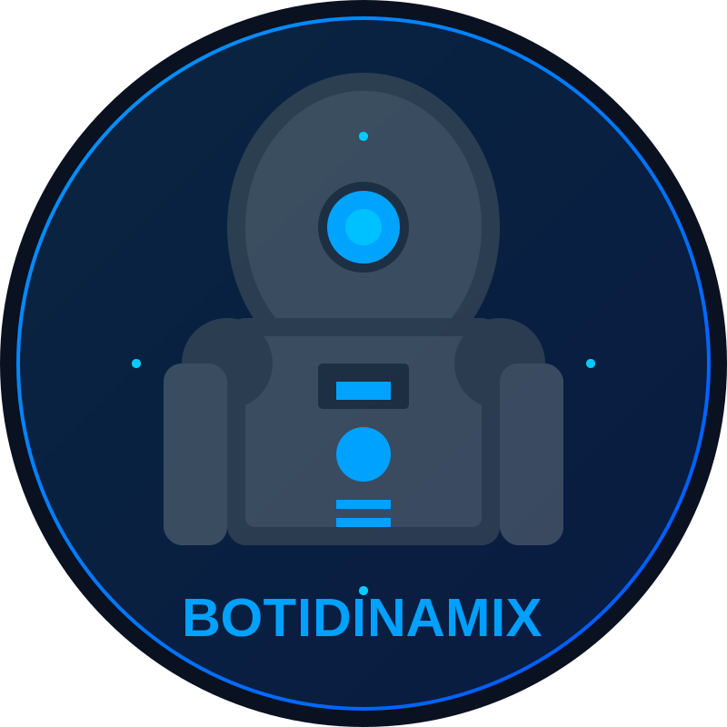

# CODESTORM

<div align="center">
  
  <h3>Plataforma de Desarrollo Autónomo Impulsada por IA</h3>
  <p><i>Desarrollado por BOTIDINAMIX AI</i></p>
</div>

## 🌩️ ¿Qué es CODESTORM?

CODESTORM es una plataforma avanzada de desarrollo autónomo que revoluciona la forma en que se crean aplicaciones y soluciones de software. Utilizando un sistema de agentes especializados impulsados por IA, CODESTORM automatiza y optimiza todo el proceso de desarrollo, desde la planificación inicial hasta la generación y organización del código.

La plataforma está diseñada para:
- **Acelerar el desarrollo** de proyectos complejos mediante la automatización inteligente
- **Mejorar la calidad del código** a través de análisis y optimizaciones continuas
- **Facilitar la colaboración** entre humanos e IA en el proceso de desarrollo
- **Proporcionar una experiencia interactiva** con retroalimentación en tiempo real

## ✨ Características Principales

### 🤖 Sistema de Agentes Especializados

CODESTORM implementa una arquitectura modular con agentes especializados que trabajan en conjunto:

| Agente | Función |
|--------|---------|
| **Agente de Planificación** | Analiza los requisitos y crea planes detallados de desarrollo |
| **Agente de Generación de Código** | Produce código de alta calidad basado en los planes establecidos |
| **Agente de Sincronización de Archivos** | Mantiene sincronizados los archivos entre el terminal y el explorador |
| **Agente de Modificación de Código** | Realiza cambios inteligentes en el código existente con actualización automática del preview |
| **Agente de Observación de Archivos** | Monitorea en tiempo real los archivos creados y su estructura |
| **Agente de Separación de Código** | Segmenta automáticamente código combinado en archivos individuales |
| **Agente de Corrección de Código** | Detecta y corrige errores de sintaxis, lógica, seguridad y rendimiento |
| **Agente de Seguimiento** | Documenta el proceso de desarrollo y mantiene un registro del progreso |
| **Agente Lector** | Analiza archivos existentes y proporciona contexto para modificaciones |
| **Agente de Diseño Arquitectónico** | Genera automáticamente archivos HTML/CSS para interfaces visuales |

### 🔍 Función "Enhance Prompt"

Una característica innovadora que mejora automáticamente las instrucciones del usuario antes de enviarlas al sistema:
- Clarifica requisitos ambiguos
- Añade detalles técnicos relevantes
- Optimiza la estructura de la solicitud
- Mejora la precisión de los resultados generados
- Proporciona retroalimentación visual durante el proceso de mejora

### 🏗️ Constructor con Sistema de Aprobación por Etapas

Un flujo de trabajo conversacional que otorga al usuario control total sobre el proceso de creación:
- Sistema de aprobación por etapas para validar cada fase del desarrollo
- Chat interactivo avanzado para comunicación fluida con los agentes
- Corrector de código inteligente que sugiere mejoras y soluciones
- Visualización en tiempo real del progreso del proyecto
- Métricas detalladas del avance por etapas y tipos de archivos

### 🔧 Corrector de Código Avanzado

Un potente sistema de análisis y corrección de código con características avanzadas:
- Detección inteligente de errores de sintaxis, lógica, seguridad y rendimiento
- Panel visual de resultados con diferenciación clara de cambios (adiciones, eliminaciones, modificaciones)
- Resaltado de sintaxis adaptado al lenguaje de programación detectado
- Opciones para copiar, descargar o aplicar los cambios directamente
- Resumen estadístico de correcciones realizadas por tipo y severidad
- Interfaz completamente responsive con animaciones sutiles

### ✂️ Separador de Código

Herramienta especializada que:
- Analiza bloques de código extensos
- Identifica componentes lógicos y funcionales
- Separa el código en archivos independientes con la estructura adecuada
- Mantiene la coherencia entre los archivos generados

### 👁️ Observador de Archivos

Sistema de monitoreo que:
- Analiza en tiempo real la estructura y contenido de los archivos
- Proporciona visualizaciones del árbol de archivos
- Mejora las sugerencias durante el desarrollo
- Comunica información relevante a otros agentes del sistema

### 🎨 Interfaz Moderna y Responsiva

- Diseño adaptable para dispositivos móviles y de escritorio
- Animaciones sutiles inspiradas en el concepto de "tormenta de código"
- Paneles colapsables para optimizar el espacio de trabajo
- Botones flotantes mejorados con navegación al menú principal
- Logo de BOTIDINAMIX AI posicionado en la esquina superior izquierda
- Temas visuales personalizables con efectos futuristas

### 🔄 Actualización Automática del Preview

Una característica revolucionaria que mejora la experiencia de desarrollo:

- **Detección inteligente** de archivos estáticos (HTML, CSS, JavaScript)
- **Actualización en tiempo real** del CodePreview/WebView cuando se modifican archivos
- **Sincronización automática** entre modificaciones y vista previa
- **Feedback visual inmediato** sin intervención manual del usuario
- **Comunicación eficiente** mediante eventos personalizados entre componentes

### 🧩 Segmentación Automática de Código

Sistema avanzado de separación de archivos integrado en toda la plataforma:

- **Detección automática** de código combinado que necesita segmentación
- **Análisis inteligente** por patrones de comentarios, bloques de código y declaraciones
- **Generación de archivos individuales** perfectamente organizados
- **Consistencia total** entre página principal y Constructor
- **Manejo robusto** de errores con fallbacks seguros

### 🏗️ Generación Automática de Interfaces Visuales

El DesignArchitectAgent ahora está integrado en toda la plataforma:

- **Generación automática** de archivos HTML/CSS para TODAS las aplicaciones
- **Detección inteligente** de colores y paletas profesionales por industria
- **Diseño responsivo** mobile-first con estructura HTML5 semántica
- **Variables CSS** organizadas y cumplimiento de accesibilidad WCAG 2.1 AA
- **Integración transparente** sin afectar la funcionalidad existente

## 🛠️ Tecnologías Utilizadas

- **Frontend**: React, TypeScript, Tailwind CSS
- **Modelos de IA**: Claude (Anthropic), GPT (OpenAI), Gemini (Google)
- **Herramientas de Desarrollo**: Vite, ESLint, TypeScript
- **Backend**: Express (servidor proxy para APIs)
- **Utilidades**: JSZip, File-Saver, React Router, XTerm
- **Análisis de Código**: Diff, SyntaxHighlighter, Prism

## 🚀 Instalación y Configuración

### Requisitos Previos

- Node.js (v16 o superior)
- npm (v8 o superior) o yarn (v1.22 o superior)
- Acceso a las APIs de los modelos de IA (OpenAI, Anthropic, Google)

### Paso a Paso

1. **Clonar el Repositorio**

   ```bash
   git clone https://github.com/tu-usuario/codestorm.git
   cd codestorm
   ```

2. **Instalar Dependencias**

   ```bash
   npm install
   # o
   yarn install
   ```

3. **Configurar Variables de Entorno**

   Crea un archivo `.env` en la raíz del proyecto:

   ```env
   VITE_OPENAI_API_KEY=tu_clave_de_openai
   VITE_ANTHROPIC_API_KEY=tu_clave_de_anthropic
   VITE_GEMINI_API_KEY=tu_clave_de_gemini
   PORT=3001
   ```

4. **Iniciar la Aplicación**

   ```bash
   npm run start
   # o
   yarn start
   ```

   Esto iniciará tanto el servidor proxy como la aplicación frontend.

5. **Acceder a la Aplicación**

   Abre tu navegador y visita:

   ```
   http://localhost:3001
   ```

## 📂 Estructura del Proyecto

```plaintext
codestorm/
├── public/                  # Archivos estáticos
│   ├── botidinamix-logo.svg # Logo de BOTIDINAMIX
│   └── ...                  # Otros recursos estáticos
├── src/                     # Código fuente
│   ├── agents/              # Implementación de agentes IA
│   ├── components/          # Componentes React
│   │   ├── constructor/     # Componentes del Constructor
│   │   └── ...              # Otros componentes
│   ├── contexts/            # Contextos de React
│   ├── data/                # Datos estáticos
│   ├── pages/               # Páginas principales
│   ├── services/            # Servicios (AI, terminal)
│   ├── App.tsx              # Componente principal
│   └── main.tsx             # Punto de entrada
├── server.js                # Servidor proxy para APIs
├── package.json             # Dependencias y scripts
├── tailwind.config.js       # Configuración de Tailwind
└── vite.config.js           # Configuración de Vite
```

## 📈 Changelog - Últimas Mejoras

### 🆕 Versión 2.5.0 - Enero 2025

#### ✨ **Nuevas Características:**

- **🔄 Actualización Automática del Preview**: Los cambios en archivos estáticos (HTML, CSS, JS) se reflejan automáticamente en el CodePreview/WebView sin intervención manual
- **🧩 Segmentación Automática de Código**: Integración del CodeSplitterAgent en la página principal para separar automáticamente código combinado en archivos individuales
- **🏗️ Generación Automática de Interfaces**: El DesignArchitectAgent ahora genera archivos HTML/CSS automáticamente para TODAS las aplicaciones
- **🏠 Botón de Menú Principal**: Nuevo botón flotante para navegación rápida al menú principal desde cualquier página
- **📍 Logo Reposicionado**: Logo de BOTIDINAMIX AI movido a la esquina superior izquierda para mejor accesibilidad

#### 🔧 **Mejoras Técnicas:**

- **Detección inteligente** de archivos estáticos con múltiples criterios (extensión, nombre, contenido)
- **Comunicación eficiente** mediante eventos personalizados entre componentes
- **Manejo robusto de errores** con fallbacks seguros en todos los procesos
- **Optimización móvil** mejorada para botones flotantes y navegación
- **Consistencia total** entre página principal y Constructor

#### 🐛 **Correcciones:**

- Solucionado error en AgentStatus.tsx con tipos de agentes no definidos
- Mejorada la responsividad de botones flotantes en dispositivos móviles
- Optimizada la sincronización entre modificaciones de archivos y vista previa
- Corregidos problemas de navegación en el panel de botones flotantes

## 📸 Capturas de Pantalla

<div align="center">
  
  <p><i>Interfaz Principal de CODESTORM con nuevas características</i></p>

  
  <p><i>Constructor con Segmentación Automática y Generación de Interfaces</i></p>

  
  <p><i>Actualización Automática del Preview en Tiempo Real</i></p>

  
  <p><i>Panel de Botones Flotantes Mejorado con Navegación</i></p>
</div>

## 🤝 Contribuir

Las contribuciones son bienvenidas y apreciadas. Para contribuir:

1. Haz un fork del repositorio
2. Crea una rama para tu característica (`git checkout -b feature/amazing-feature`)
3. Realiza tus cambios y haz commit (`git commit -m 'Add some amazing feature'`)
4. Sube tus cambios (`git push origin feature/amazing-feature`)
5. Abre un Pull Request

## 📄 Licencia

Este proyecto está licenciado bajo la Licencia MIT - consulta el archivo [LICENSE](LICENSE) para más detalles.

## 🙏 Agradecimientos

- Desarrollado por el equipo de BOTIDINAMIX AI
- Inspirado en las necesidades reales de desarrolladores
- Impulsado por modelos de IA de vanguardia

---

<div align="center">
  <p>BOTIDINAMIX AI - Todos los derechos reservados © 2025</p>
</div>
